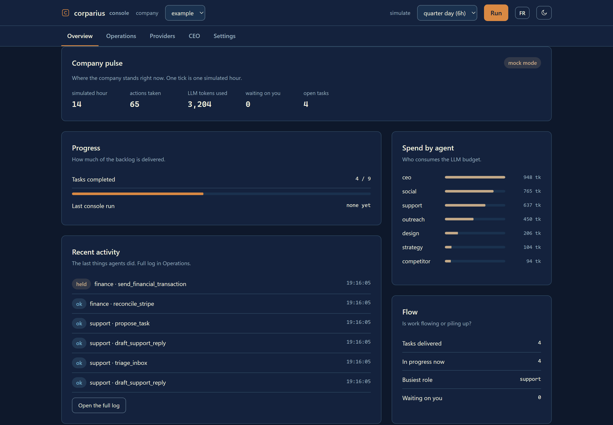

# corparius

[](https://github.com/MariusYvard/corparius/actions/workflows/ci.yml)
[](https://www.python.org/)
[](LICENSE)
[](docs/architecture.md)

Self-hosted framework for autonomous AI micro-companies. Describe a business in
plain language; corparius runs it as a set of scheduled cognitive agents (a CEO
plus nine operational roles) that pursue one signal, revenue, while a budget and
loop firewall stops them running away.

It is the local-first answer to hosted platforms like NanoCorp and Polsia: the
company config, the runtime state and the models stay on your own machine. Cloud
LLMs are an opt-in escalation, never a requirement. Ship nothing you cannot audit.

> Status: working MVP. The orchestrator, the safety firewall, the human-in-the-loop
> gate, the operator console and the ten-agent roster run end to end against a
> deterministic mock LLM, so you can watch a full company day with no network and
> no API keys. Live providers (Ollama, Anthropic, 12 free tiers, Claude Code CLI,
> any OpenAI-compatible gateway) are wired in and selected by config.

## Contents

[How it works](#how-it-works) ·
[The roster](#the-roster) ·
[Quick start](#quick-start) ·
[Operator console](#operator-console) ·
[LLM routing](#llm-routing) ·
[Safety firewall](#safety-firewall) ·
[Human in the loop](#human-in-the-loop) ·
[Compliance](#compliance-france--eu) ·
[Project layout](#project-layout) ·
[Documentation](#documentation) ·
[Contributing](#contributing)

## How it works

```
company.yaml  ->  Scheduler        picks the agents due this tick
                     |
                     v
                  Agent turn        system prompt + company state -> LLM
                     |                 (HybridRouter: local first, remote
                     |                  on escalation, fallback chain)
                     v
                  Tool calls        guarded by the safety firewall
                     |                  - TokenBudget      (hard ceiling)
                     |                  - LoopGuard        (semantic stutter)
                     |                  - CircuitBreaker   (spend velocity)
                     v
                  HITL gate         money / prod code -> wait for a human
                     |
                     v
                  Store (SQLite)    actions, usage, approvals, tasks, KPIs
                     |
                     v
                  Interfaces        CLI · operator console (web) · MCP server
```

Each agent runs on its own cadence (the CEO twice a day, outreach every three
hours, and so on). A tick advances the clock, runs whatever is due, records every
action and token, and stops the moment a guard trips.

## The roster

Ten roles, each with a fixed cadence and a narrow toolset. Cadences are staggered
so the company does not spend its whole budget in one burst.

| Agent | Cadence | Does |
| --- | --- | --- |
| CEO (orchestrator) | twice a day | Owns the backlog: creates and arbitrates tasks, sets the plan, writes the EOD summary |
| Social media | every 2h | Drafts and schedules posts for X and LinkedIn |
| Outreach | every 3h | Finds targets from enriched data, sends cold email |
| Support | every 3h | Triages the inbox, drafts replies |
| Ads | every 6h | Tracks ad budgets, writes variants, adjusts bids |
| Finance | every 6h | Reconciles Stripe flows, tracks spend, computes the balance |
| Strategy | daily | Reads KPIs, adjusts pricing, updates the roadmap |
| Competitor | daily | Web research, updates competitor profiles |
| Design | daily | Visual direction, brand consistency, builds the sales site |
| Coder | on demand | Builds features, fixes bugs, opens pull requests |

## Quick start

Runs offline out of the box (mock LLM, SQLite). No keys, no models, no accounts.

```bash
git clone https://github.com/MariusYvard/corparius.git && cd corparius
python -m venv .venv && . .venv/Scripts/activate   # Windows; use bin/activate on Linux
pip install -r requirements.txt
cp .env.example .env

python -m app.cli init --company companies/example/company.yaml
python -m app.cli run  --company example --ticks 6   # simulate a day
python -m app.cli ui                                 # operator console on :8600
```

The CLI covers everything the console does: `status`, `tasks`, `task`, `board`,
`flow`, `approvals`, `approve`, `reject`, `site`, `deploy`. Docker users:
`docker compose up -d` starts the loop against the example company.

## Operator console

`python -m app.cli ui` serves a zero-dependency web console on
`http://127.0.0.1:8600` (Python standard library only, single HTML file, dark
and light themes).



It gives you, per company: a pulse view (tick, actions, tokens, open work), lean
flow metrics with the current bottleneck, per-agent spend, the action log, the
approval queue with inline approve and reject, the CEO-governed backlog as a
kanban with one-click arbitration of proposals, run control (launch ticks in the
background), a providers panel to flip mock or cloud mode, edit routing tiers
and store API keys, and a chat with the CEO agent that answers from live company
state through your configured routing.

The console binds to localhost. Keys posted from the page are write-only (applied
to the process, persisted to `.env`, never displayed back). Set `CORP_UI_TOKEN`
to require a header on every mutating call if you put it behind a reverse proxy.
Details in `docs/console.md`.

## LLM routing

Three difficulty tiers, each mapped to a `<target>:<model>` string in `.env`.
Flip a prefix to move a tier between providers; keep any tier fully on-prem.

| Target | Serves | Needs |
| --- | --- | --- |
| `local:` | Ollama on your machine | nothing but the model |
| `cloud:` | Anthropic API | `ANTHROPIC_API_KEY` (paid credits) |
| `claudecode:` | Claude Code CLI, subscription auth | the CLI logged in, no API credits |
| `groq:` `cerebras:` `openrouter:` `mistral:` `gemini:` `nvidia:` `github:` `cohere:` `huggingface:` `ovh:` `zhipu:` `siliconflow:` `cloudflare:` | 12 free-tier providers, OpenAI-compatible | one API key each, free |
| `custom:` | any OpenAI-compatible gateway (OmniRoute, LiteLLM, vLLM, LM Studio) | `CORP_CUSTOM_LLM_URL` |

```bash
CORP_TRIVIAL_MODEL=local:gemma4:e4b
CORP_NORMAL_MODEL=groq:llama-3.3-70b-versatile
CORP_HARD_MODEL=openrouter:deepseek/deepseek-r1-0528:free
CORP_LLM_FALLBACK=cerebras:gpt-oss-120b,mistral:mistral-small-latest
```

When a remote call fails (rate limit, outage), the router walks the
`CORP_LLM_FALLBACK` chain in order; local Ollama always ends the chain, so the
company keeps working offline. Free-tier limits, signup links and privacy notes
per provider: `docs/llm-providers.md`.

## Safety firewall

An autonomous agent left alone with an API and a credit card is a runaway-cost
incident waiting to happen. Three guards sit in front of every turn:

- `TokenBudget` is a hard per-session ceiling, checked before each call and
  updated after. Once spent, the agent halts and the operator is notified.
- `LoopGuard` catches semantic stutter. If the cosine similarity between the
  last outputs stays above the threshold across successive turns, or the same tool
  is called with identical parameters too many times, the turn is suspended.
- `CircuitBreaker` watches spend velocity. A sustained burst past the limit trips
  the breaker into a conservative, then safe, mode; safe mode freezes the session.

See `docs/securite.md` for the model and thresholds.

## Human in the loop

Some actions never run unattended. Any tool named in `CORP_HITL_TOOLS`
(`send_financial_transaction` and `publish_production_code` by default) pauses the
run and files an approval request with the full tool name and parameters. Approve
or reject from the console, the CLI or the MCP server. A rejection is handed back
to the agent as a normal, recoverable tool error.

## Compliance (France / EU)

Self-hosting the operations does not exempt the business from the law. `docs/`
covers the parts that bite: e-invoicing through an approved PDP (Factur-X, the
2027 B2B mandate), ten-year archival, the choice of legal form, and where the EU
AI Act classifies an agent as high-risk. Read `docs/conformite-fr.md` before you
point this at real customers.

## Project layout

```
app/
  config.py        env-driven settings (dataclass, CORP_ prefix)
  models.py        typed records: agents, actions, approvals, LLM results
  llm.py           HybridRouter + Ollama, Anthropic, 12 free OpenAI-compatible
                   providers, Claude Code CLI and Mock
  safety.py        TokenBudget, LoopGuard, CircuitBreaker
  tools.py         the business toolbox, with HITL flags
  sitegen.py       single-file sales-page generator
  deploy.py        interchangeable deploy providers (local, Netlify, S3, SSH)
  leadsource.py    interchangeable lead sources (local dataset, headless browser)
  enrich.py        lead enrichment providers (local heuristic, API-ready)
  deliverability.py outreach guard (suppression list, daily cap / warmup)
  signals.py       buying-signal watcher (local feed, headless browser)
  agents.py        the ten-agent roster + the turn executor
  hitl.py          approval gate and queue
  orchestrator.py  scheduler (cadences) + runtime (the tick loop)
  store.py         SQLite persistence
  webui.py         operator console server (stdlib HTTP, JSON API)
  webui.html       operator console page (single file, no build step)
  cli.py           init / run / status / tasks / board / flow / site / deploy / ui
  mcp_server.py    optional MCP server (drive corparius from an MCP host)
companies/example/ a sample company config
docs/              architecture, safety, compliance, and the RE dossier
tests/             63 tests: guards, routing, backlog, console, pipeline
```

## Documentation

| Doc | Covers |
| --- | --- |
| `docs/architecture.md` | orchestration topology, tiered router, durable execution |
| `docs/console.md` | the operator console (API, security model) |
| `docs/llm-providers.md` | every free LLM provider: limits, keys, privacy notes |
| `docs/securite.md` | the safety firewall and the Agent SRE mapping |
| `docs/conformite-fr.md` | e-invoicing (PDP, Factur-X), legal forms, EU AI Act |
| `docs/backlog.md` | the CEO-governed task backlog |
| `docs/lean.md` | pull flow, WIP limits, flow metrics, kaizen |
| `docs/integrations.md` | the real-or-mock backend pattern (Stripe, SMTP) |
| `docs/site.md` `docs/deploiement.md` | sales-site generator and multi-provider publishing |
| `docs/leads.md` `docs/pipeline.md` | lead research, enrichment, deliverability, signals |
| `docs/mcp.md` | driving corparius from any MCP host |
| `docs/roadmap-90j.md` | the 90-day build cycle |
| `docs/reverse-engineering/` | teardowns of NanoCorp, Polsia and Uclic |

## Contributing

Issues and pull requests are welcome. Keep changes surgical, match the existing
conventions (dataclass config, provider registries with a local fallback, mock
mode must keep working offline) and make sure `python -m pytest` stays green.
New providers belong in the `OPENAI_COMPAT_PROVIDERS` registry with a
documentation row in `docs/llm-providers.md`.

## License

MIT. See [LICENSE](LICENSE).

Reference implementation for research and self-hosting. Autonomous outreach,
billing and publishing carry legal and reputational risk; you are the operator
and the agent acts on your behalf. Keep the HITL gate on anything that spends
money or ships code.
