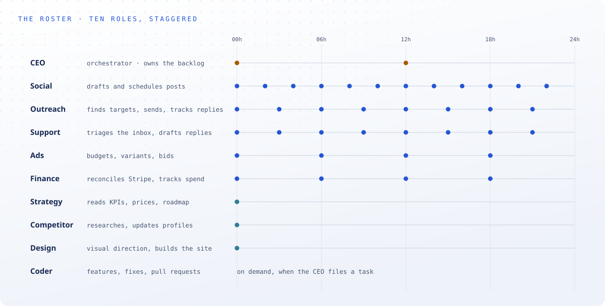
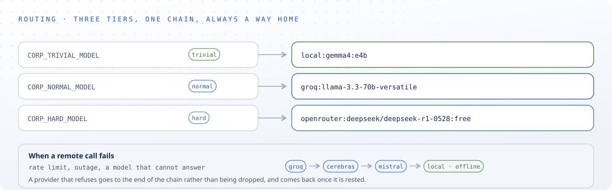
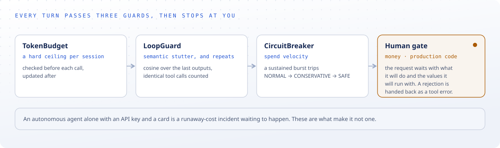
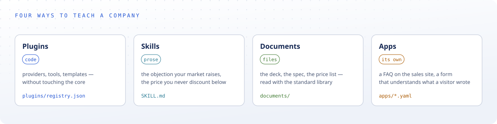

<p align="center">
  <picture>
    <source media="(prefers-color-scheme: dark)" srcset="docs/banner-dark.svg">
    
  </picture>
</p>

<p align="center">
  <a href="https://github.com/MariusYvard/corparius/actions/workflows/ci.yml"></a>
  
  <a href="LICENSE"></a>
  
  
</p>

# corparius

Describe a business in plain language. corparius runs it as ten scheduled agents —
a CEO and nine operational roles — that pursue one signal, revenue, behind a budget
and a loop firewall. **Everything stays on your machine**: the config, the state,
and the models. Cloud LLMs are an opt-in escalation, never a requirement.

> **Working MVP.** The orchestrator, the firewall, the approval gate, the console
> and the ten-agent roster run end to end against a deterministic mock LLM — a full
> company day, offline, with no keys. Live providers are wired in and selected by
> config, and `corparius preflight` proves by one real call which of them your
> account can actually reach.

[Quick start](#quick-start) ·
[How it works](#how-it-works) ·
[The roster](#the-roster) ·
[Console](#the-console) ·
[Routing](#routing) ·
[Guards](#the-guards) ·
[Teaching a company](#teaching-a-company) ·
[Settings](#where-settings-live) ·
[Structure](#structure) ·
[Compliance](#compliance-france--eu) ·
[Docs](#documentation) ·
[Support](#support) ·
[Contributing](#contributing) ·
[License](#license)

## Quick start

Runs offline out of the box (mock LLM, SQLite). No keys, no models, no accounts.

**No Python, no terminal, no clone — download one file and open it.** From the
[latest release](https://github.com/MariusYvard/corparius/releases/latest):

| System | Download | Then |
| --- | --- | --- |
| Windows x64 | `corparius-windows-x64.exe` | double-click (SmartScreen: More info → Run anyway) |
| macOS (Apple Silicon) | `corparius-macos-arm64.zip` | unzip, right-click `corparius.app` → Open |
| macOS (Intel, 15+) | `corparius-macos-x64.zip` | unzip, right-click `corparius.app` → Open |
| Linux x64 | `corparius-linux-x64` | `chmod +x corparius-linux-x64 && ./corparius-linux-x64` |

The builds are unsigned, so the OS shows a first-run warning; the steps above get
past it. Your data lives in a per-OS folder, so a newer build keeps every company
and setting. [docs/install.md](docs/install.md) has the exact screens.

From source instead — double-click `start-windows.bat`, `start-macos.command` or
`start-linux.sh` (Python 3.10+ is the only prerequisite; it makes the venv,
installs, prepares the example company and opens the console). Or a terminal:

```bash
git clone https://github.com/MariusYvard/corparius.git && cd corparius
python start.py                                          # venv, deps, example company, browser
docker compose up -d                                     # or Docker, console on :8600 + Ollama
docker run -d -p 127.0.0.1:8600:8600 -v corparius_data:/app/data ghcr.io/mariusyvard/corparius
```

The console walks you through your first company; `corparius doctor` diagnoses the
installation and says what to fix.

<details>
<summary><b>The CLI does everything the console does</b> — <code>corparius &lt;command&gt; --help</code> explains each one</summary>

| | |
| --- | --- |
| Run a company | `new` `delete` `init` `run` `status` `board` `flow` `tasks` `task` `docs` |
| Decide | `ceo` `approvals` `approve` `reject` `rules` `inbox` `memory` |
| Ship | `site` `deploy` `repo` `apps` |
| Models | `bench` `preflight` `claude` |
| Extend | `plugin` `skills` |
| Keep it running | `doctor` `ui` `set` `mail` `backup` `restore` `update` `secrets` |
| Let a device in | `pair` `clients` `revoke` |

</details>

## How it works

<p align="center">
  <picture>
    <source media="(prefers-color-scheme: dark)" srcset="docs/readme/pipeline-dark.svg">
    
  </picture>
</p>

A tick advances the clock, runs whatever is due, records every action and token,
and stops the moment a guard trips.

## The roster

<p align="center">
  <picture>
    <source media="(prefers-color-scheme: dark)" srcset="docs/readme/roster-dark.svg">
    
  </picture>
</p>

Each role has a narrow toolset and its own cadence. The cadences are **staggered on
purpose** — a company that woke every agent at once would spend its whole budget in
one burst.

<p align="center">
  <picture>
    <source media="(prefers-color-scheme: dark)" srcset="docs/readme/rule-dark.svg">
    
  </picture>
</p>

## The console

<p align="center">
  <picture>
    <source media="(prefers-color-scheme: dark)" srcset="docs/screenshots/console-dark.png">
    
  </picture>
</p>

`corparius ui` serves it on `http://127.0.0.1:8600` — Svelte, built in CI, and
**served with no Node installed anywhere**. English and French, dark and light.

It leads with what needs you. The approval queue is first on the page, and each
request shows **what is about to happen** — the drafted sentence and the values it
will run with — rather than the tool's description of itself. Being asked to press
Approve on a verb is not consent.

Nothing here needs a text editor. Seven tabs cover the backlog as a kanban you can
arbitrate, run control, per-agent spend, the sales site, documents, every provider
key, the mail account, Stripe, and a chat with the CEO. And when you do not know
what to do next, the CEO tab derives it from the store — decisions waiting, a
question in the inbox, drafts nobody has read — and every one is a button that
**takes you there** rather than a sentence telling you where to go.

The console binds to localhost, and keys posted from it are write-only: stored,
never displayed back. `corparius pair` issues a credential per device (`scrypt`,
constant-time compare, shown once, `read` or `act`). A versioned JSON API lives at
`/api/v1` with one error envelope and an `ETag` on every GET. There is deliberately
**no TLS** — the honest answer for a stdlib server is loopback plus a tunnel, and
the doctor fails if a device credential exists while the listener is off loopback.
[docs/console.md](docs/console.md).

## Routing

<p align="center">
  <picture>
    <source media="(prefers-color-scheme: dark)" srcset="docs/readme/routing-dark.svg">
    
  </picture>
</p>

Flip a prefix to move a tier between providers; keep any tier fully on-prem.

```bash
CORP_TRIVIAL_MODEL=local:gemma4:e4b
CORP_NORMAL_MODEL=groq:llama-3.3-70b-versatile
CORP_HARD_MODEL=openrouter:deepseek/deepseek-r1-0528:free
CORP_LLM_FALLBACK=cerebras:gpt-oss-120b,mistral:mistral-small-latest
```

<details>
<summary><b>Every target, and what each one needs</b></summary>

| Target | Serves | Needs |
| --- | --- | --- |
| `local:` | Ollama on your machine | nothing but the model |
| `cloud:` | Anthropic API | `ANTHROPIC_API_KEY` (paid credits) |
| `claudecode:` | Claude Code CLI, subscription auth | the CLI logged in, no API credits |
| `groq:` `cerebras:` `openrouter:` `mistral:` `gemini:` `nvidia:` `github:` `cohere:` `huggingface:` `ovh:` `zhipu:` `siliconflow:` `cloudflare:` `alibaba:` | 14 OpenAI-compatible providers on a free tier or a free trial quota | one API key each, free |
| `openai:` | OpenAI, OpenAI-compatible | `OPENAI_API_KEY` (billed from the first call) |
| `custom:` | any OpenAI-compatible gateway (OmniRoute, LiteLLM, vLLM, LM Studio) | `CORP_CUSTOM_LLM_URL` |

Limits, signup links and privacy notes per provider:
[docs/llm-providers.md](docs/llm-providers.md).

</details>

**Measured, not declared.** A catalogue lists models that exist, not models your
account may call, and a card advertising structured output is not proof the model
can produce JSON. `corparius preflight` settles it with one real 8-token call and
stores the verdict. On a real key: **10 of 18 sampled NVIDIA entries answer 404**,
and **two of four models in a working fallback chain cannot produce JSON**. The
recommended routing refuses a model measured dead, and verdicts age so a provider
blocked six months ago gets another chance.

## The guards

<p align="center">
  <picture>
    <source media="(prefers-color-scheme: dark)" srcset="docs/readme/guards-dark.svg">
    
  </picture>
</p>

Any tool named in `CORP_HITL_TOOLS` (`send_financial_transaction`,
`publish_production_code` and `deploy_site` by default) pauses the run and files an
approval. Decide from the console, the CLI or the MCP server; a rejection is handed
back to the agent as a normal, recoverable tool error.
[docs/securite.md](docs/securite.md) has the thresholds.

<p align="center">
  <picture>
    <source media="(prefers-color-scheme: dark)" srcset="docs/readme/rule-dark.svg">
    
  </picture>
</p>

## Teaching a company

<p align="center">
  <picture>
    <source media="(prefers-color-scheme: dark)" srcset="docs/readme/teaching-dark.svg">
    
  </picture>
</p>

**Plugins** add providers, tools or templates without touching the core. They are
off by default and curated — verified means listed in the reviewed
`plugins/registry.json`, and unverified third-party code loads only behind an
explicit opt-in. `corparius plugin install <name>` downloads at a pinned ref and
verifies the SHA-256. [docs/plugins.md](docs/plugins.md)

**Skills** are what your company knows in prose: the objection your market raises,
the price you never discount below. A `SKILL.md` folder with frontmatter, and
`allowed-tools` decides everything — the body enters a prompt only when the tool
about to run is one it names, so a turn pays for the skills that apply to it and
nothing else. [docs/skills.md](docs/skills.md)

**Documents** are the files it already has. A PDF, `.docx`, `.pptx`, `.xlsx`, CSV,
Markdown and plain text are read **with the standard library** — no new dependency,
and nothing invented: a scanned PDF says "no text layer this build can read" rather
than returning noise. A picture is *sent*, not described, and only to a model
`preflight` has measured can read one. Every readable file is reduced to its
headings, and that map rides on every prompt; the budget decides which sections get
quoted, ranked against what the agent is about to do.
[docs/documents.md](docs/documents.md)

**Apps** put the providers you already configured behind something other than the
roster — a FAQ on the sales site, a form that understands what a visitor wrote.
A YAML file with its own token ceiling, rate limit and origin list, and its spend
shows up in the console under `app:<name>`. No second API key.
[docs/apps.md](docs/apps.md)

## Where settings live

Every setting resolves through four layers, first hit wins:

| Layer | Source | Set it from |
| --- | --- | --- |
| 1 | the real process environment | your shell, systemd, docker `environment:` |
| 2 | the settings saved from the console | the console |
| 3 | `.env` | a text editor |
| 4 | the default in the code | — |

The console can set everything in layer 2, and it says which layer answers for each
field: a value pinned by the process environment is shown read-only rather than
accepting an edit that would do nothing. Bootstrap keys (`CORP_DATA_PATH`,
`CORP_LOG_LEVEL`, `CORP_UI_HOST`, `CORP_UI_PORT`, `CORP_UI_TOKEN`) must be readable
before the database opens, so they live in `.env` and apply on restart.

Keys saved from the console land in `data/corparius.sqlite`, in the clear by
default, which the panel and the doctor both say. `corparius secrets on` encrypts
them at rest; `CORP_SECRET_KEY` is the passphrase and is a bootstrap key, so it
never lives in the database it protects. A backup zip never carries a plaintext
secret either way.

## Structure

Seven directories, seven ranks, and a rule held by a test rather than by good
intentions: **a module of rank *n* imports only ranks ≤ *n*** — deferred imports
included. `tests/test_layers.py` reads the import graph with the AST and fails on a
new upward edge, and equally on a violation that was fixed and not struck off the
list.

```text
kernel/ 0   stdlib only        providers/ 3   the outside world
config/ 1   settings resolver  domain      4   agents, tools, documents, sitegen
store/  2   the only sqlite3   app/       5   use cases, no transport
                               api/ cli/  6   HTTP, CLI, MCP — nothing imports these
```

Reading a setting no longer loads `requests` or `subprocess`, and the domain cannot
touch the network, sqlite or a subprocess — a gate rather than an observation.
[docs/architecture-code.md](docs/architecture-code.md) has the table and the
measurements; [docs/adr/](docs/adr/) has one decision per file.

## Compliance (France / EU)

Self-hosting the operations does not exempt the business from the law.
[docs/conformite-fr.md](docs/conformite-fr.md) covers the parts that bite:
e-invoicing through an approved PDP (Factur-X, the 2027 B2B mandate), ten-year
archival, the choice of legal form, and where the EU AI Act classifies an agent as
high-risk. Read it before you point this at real customers.

## Documentation

| Doc | Covers |
| --- | --- |
| `docs/architecture.md` | orchestration topology, tiered router, durable execution |
| `docs/architecture-code.md` | seven directories, seven ranks, and the test that enforces the rule |
| `docs/adr/` | architecture decisions, one per file, each carrying its measurement |
| `docs/console.md` | the operator console (API, security model) |
| `docs/llm-providers.md` | every free LLM provider: limits, keys, privacy notes |
| `docs/securite.md` | the safety firewall and the Agent SRE mapping |
| `docs/conformite-fr.md` | e-invoicing (PDP, Factur-X), legal forms, EU AI Act |
| `docs/backlog.md` `docs/lean.md` | the CEO-governed backlog; pull flow, WIP limits, kaizen |
| `docs/integrations.md` | the real-or-mock backend pattern (Stripe, SMTP) |
| `docs/site.md` `docs/deploiement.md` | sales-site generator and multi-provider publishing |
| `docs/leads.md` `docs/pipeline.md` | lead research, enrichment, deliverability, signals |
| `docs/mcp.md` | driving corparius from any MCP host |
| `docs/plugins.md` `docs/skills.md` | writing plugins; teaching a company its trade in prose |
| `docs/documents.md` `docs/apps.md` | the company's own files; its own apps on its own providers |
| `docs/memoire.md` | yesterday vs what stays true: durable memory |
| `docs/install.md` `docs/versionnement.md` | download/run per OS; how a version is decided |
| `docs/roadmap-90j.md` | the 90-day build cycle |
| `docs/reverse-engineering/` | teardowns of NanoCorp, Polsia, Uclic, OpenWorker and others |

## Support

corparius is free, MIT-licensed and self-hosted; there is no paid tier and no
telemetry. If it earns its keep in your homelab, you can support the work through
[GitHub Sponsors](https://github.com/sponsors/MariusYvard).

## Contributing

Issues and pull requests are welcome. Keep changes surgical, match the existing
conventions (dataclass config, provider registries with a local fallback, mock mode
must keep working offline) and make sure `python -m pytest` stays green. New
providers belong in the `OPENAI_COMPAT_PROVIDERS` registry with a documentation row
in `docs/llm-providers.md`.

## License

MIT. See [LICENSE](LICENSE).

Reference implementation for research and self-hosting. Autonomous outreach,
billing and publishing carry legal and reputational risk; you are the operator and
the agent acts on your behalf. Keep the HITL gate on anything that spends money or
ships code.
