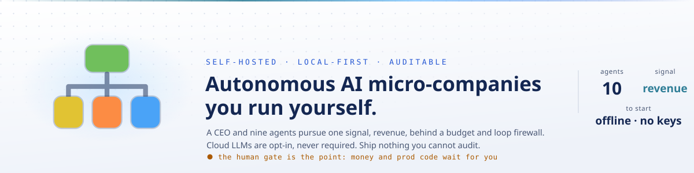
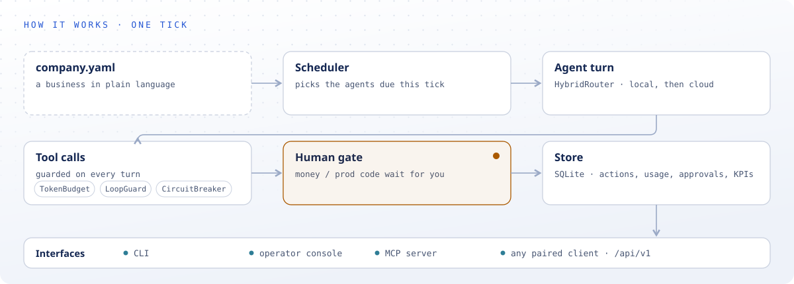
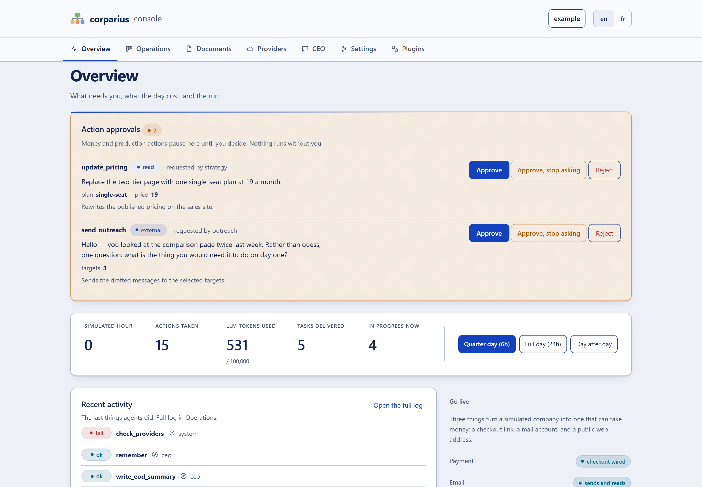

<p align="center">
  <picture>
    <source media="(prefers-color-scheme: dark)" srcset="docs/banner-dark.svg">
    
  </picture>
</p>

<p align="center">
  <a href="https://github.com/MariusYvard/corparius/actions/workflows/ci.yml"></a>
  
  <a href="LICENSE"></a>
  
  
</p>

# corparius

Describe a business in plain language; corparius runs it as a set of scheduled
cognitive agents — a CEO plus nine operational roles — that pursue one signal,
revenue, while a budget and loop firewall stops them running away.

It is the local-first answer to hosted platforms like NanoCorp and Polsia: the
company config, the runtime state and the models stay on your own machine. Cloud
LLMs are an opt-in escalation, never a requirement. Ship nothing you cannot audit.

> Status: working MVP. The orchestrator, the safety firewall, the human-in-the-loop
> gate, the operator console and the ten-agent roster run end to end against a
> deterministic mock LLM, so you can watch a full company day with no network and
> no API keys. Live providers (Ollama, Anthropic, 12 free tiers, Claude Code CLI,
> any OpenAI-compatible gateway) are wired in and selected by config.

## Contents

[How it works](#how-it-works) ·
[The roster](#the-roster) ·
[Quick start](#quick-start) ·
[Operator console](#operator-console) ·
[LLM routing](#llm-routing) ·
[Safety firewall](#safety-firewall) ·
[Human in the loop](#human-in-the-loop) ·
[Compliance](#compliance-france--eu) ·
[Project layout](#project-layout) ·
[Documentation](#documentation) ·
[Contributing](#contributing)

## How it works

<p align="center">
  <picture>
    <source media="(prefers-color-scheme: dark)" srcset="docs/readme/pipeline-dark.svg">
    
  </picture>
</p>

Each agent runs on its own cadence (the CEO twice a day, outreach every three
hours, and so on). A tick advances the clock, runs whatever is due, records every
action and token, and stops the moment a guard trips.

## The roster

Ten roles, each with a fixed cadence and a narrow toolset. Cadences are staggered
so the company does not spend its whole budget in one burst.

| Agent | Cadence | Does |
| --- | --- | --- |
| CEO (orchestrator) | twice a day | Owns the backlog: creates and arbitrates tasks, sets the plan, writes the EOD summary |
| Social media | every 2h | Drafts and schedules posts for X and LinkedIn |
| Outreach | every 3h | Finds targets, sends cold email, tracks who replied |
| Support | every 3h | Triages the inbox, drafts replies |
| Ads | every 6h | Tracks ad budgets, writes variants, adjusts bids |
| Finance | every 6h | Reconciles Stripe flows, tracks spend, computes the balance |
| Strategy | daily | Reads KPIs, adjusts pricing, updates the roadmap |
| Competitor | daily | Web research, updates competitor profiles |
| Design | daily | Visual direction, brand consistency, builds the sales site |
| Coder | on demand | Builds features, fixes bugs, opens pull requests |

<p align="center">
  <picture>
    <source media="(prefers-color-scheme: dark)" srcset="docs/readme/rule-dark.svg">
    
  </picture>
</p>

## Quick start

Runs offline out of the box (mock LLM, SQLite). No keys, no models, no accounts.

**No Python, no terminal, no clone — download one file and open it.** Grab the
build for your system from the [latest release](https://github.com/MariusYvard/corparius/releases/latest):

| System | Download | Then |
| --- | --- | --- |
| Windows x64 | `corparius-windows-x64.exe` | double-click (SmartScreen: More info → Run anyway) |
| macOS (Apple Silicon) | `corparius-macos-arm64.zip` | unzip, then right-click `corparius.app` → Open |
| macOS (Intel) | `corparius-macos-x64.zip` | unzip, then right-click `corparius.app` → Open |
| Linux x64 | `corparius-linux-x64` | `chmod +x corparius-linux-x64 && ./corparius-linux-x64` |

The builds are unsigned, so the OS shows a first-run warning; the steps above get
past it, and [docs/install.md](docs/install.md) walks through it with the exact
screens, where your data lives per OS, updating and uninstalling. Your data lives
in a per-OS folder, so re-downloading a newer build keeps every company and setting.

Prefer to run from source? Download the project, then **double-click the launcher
for your system** (needs Python 3.10+ installed):

| System | Double-click |
| --- | --- |
| Windows | `start-windows.bat` |
| macOS | `start-macos.command` (first time: right-click, Open) |
| Linux | `start-linux.sh` |

It sets up a virtualenv, installs the dependencies, prepares the example company,
opens the console in your browser, and tells you plainly if Python is missing.
The only prerequisite is Python 3.10+.

Prefer a terminal, or Docker:

```bash
git clone https://github.com/MariusYvard/corparius.git && cd corparius
python start.py        # venv, dependencies, .env, example company, console, browser
```

```bash
docker compose up -d   # operator console on http://127.0.0.1:8600 + local Ollama
```

Or pull the published image — no checkout, one command (console on
`http://127.0.0.1:8600`, offline mock mode, bound to localhost):

```bash
docker run -d -p 127.0.0.1:8600:8600 -v corparius_data:/app/data ghcr.io/mariusyvard/corparius
```

The console walks you through creating your first company; `python -m corparius.cli
doctor` diagnoses the installation and says what to fix. The CLI covers
everything the console does: `run`, `status`, `tasks`, `board`, `flow`,
`approvals`, `site`, `deploy`, `backup`. Compose profiles: `--profile loop`
adds the background company loop, `--profile extras` adds Postgres and n8n.

## Operator console

`python -m corparius.cli ui` serves a zero-dependency web console on
`http://127.0.0.1:8600` (Python standard library only, single HTML file, dark
and light themes).



The interface leads with what needs you: a status band puts the count of decisions
waiting on your approval in display scale, warm and unmissable, above everything
else, and the daily detail sits below it as a bento of varied cards rather than a
stack of identical boxes. Below the band, per company: lean flow metrics with the
current bottleneck, per-agent spend, the action log, the approval queue with
inline approve and reject, the CEO-governed backlog as a kanban you can arbitrate
and edit in place, run control (a burst of ticks or a loop you can stop), the
sales site with a headline and a publish button, backups, and a chat with the CEO
agent (given a face and a set of one-click openers) that answers from live company
state.

Nothing here needs a text editor. The company editor covers every field of the
company config; Settings covers everything corparius reads, from provider keys to
the mail account, Stripe, publishing targets, lead sources and the safety
ceilings. Connecting a mailbox is three answers: pick your provider, give the
address and an app password, then press Test and watch it send and read for real.

The console binds to localhost. Keys posted from the page are write-only: stored,
never displayed back, reported only as a `configured` boolean. Set `CORP_UI_TOKEN`
to require a header on every mutating call if you put it behind a reverse proxy.
Details in `docs/console.md`.

### Where settings live

Every setting resolves through four layers, first hit wins:

| Layer | Source | Set it from |
| --- | --- | --- |
| 1 | the real process environment | your shell, systemd, docker `environment:` |
| 2 | the settings saved from the console | the console |
| 3 | `.env` | a text editor |
| 4 | the default in the code | — |

The console can set everything in layer 2, and it says which layer answers for
each field: a value pinned by the process environment is shown read-only rather
than accepting an edit that would do nothing. Bootstrap keys (`CORP_DATA_PATH`,
`CORP_LOG_LEVEL`, `CORP_UI_HOST`, `CORP_UI_PORT`, `CORP_UI_TOKEN`) have to be
readable before the database opens, so they live in `.env` and apply on restart.

`.env` is read by corparius itself, not injected into the environment — which is
why `docker-compose.yml` mounts it instead of using `env_file:`. Keys saved from
the console are stored in the clear in `data/corparius.sqlite` (as they were in
`.env` before) and are included in `cli.py backup` zips.

## LLM routing

Three difficulty tiers, each mapped to a `<target>:<model>` string in `.env`.
Flip a prefix to move a tier between providers; keep any tier fully on-prem.

| Target | Serves | Needs |
| --- | --- | --- |
| `local:` | Ollama on your machine | nothing but the model |
| `cloud:` | Anthropic API | `ANTHROPIC_API_KEY` (paid credits) |
| `claudecode:` | Claude Code CLI, subscription auth | the CLI logged in, no API credits |
| `groq:` `cerebras:` `openrouter:` `mistral:` `gemini:` `nvidia:` `github:` `cohere:` `huggingface:` `ovh:` `zhipu:` `siliconflow:` `cloudflare:` | 12 free-tier providers, OpenAI-compatible | one API key each, free |
| `custom:` | any OpenAI-compatible gateway (OmniRoute, LiteLLM, vLLM, LM Studio) | `CORP_CUSTOM_LLM_URL` |

```bash
CORP_TRIVIAL_MODEL=local:gemma4:e4b
CORP_NORMAL_MODEL=groq:llama-3.3-70b-versatile
CORP_HARD_MODEL=openrouter:deepseek/deepseek-r1-0528:free
CORP_LLM_FALLBACK=cerebras:gpt-oss-120b,mistral:mistral-small-latest
```

When a remote call fails (rate limit, outage), the router walks the
`CORP_LLM_FALLBACK` chain in order; local Ollama always ends the chain, so the
company keeps working offline. Free-tier limits, signup links and privacy notes
per provider: `docs/llm-providers.md`.

<p align="center">
  <picture>
    <source media="(prefers-color-scheme: dark)" srcset="docs/readme/rule-dark.svg">
    
  </picture>
</p>

## Safety firewall

An autonomous agent left alone with an API and a credit card is a runaway-cost
incident waiting to happen. Three guards sit in front of every turn:

- `TokenBudget` is a hard per-session ceiling, checked before each call and
  updated after. Once spent, the agent halts and the operator is notified.
- `LoopGuard` catches semantic stutter. If the cosine similarity between the
  last outputs stays above the threshold across successive turns, or the same tool
  is called with identical parameters too many times, the turn is suspended.
- `CircuitBreaker` watches spend velocity. A sustained burst past the limit trips
  the breaker into a conservative, then safe, mode; safe mode freezes the session.

See `docs/securite.md` for the model and thresholds.

## Human in the loop

Some actions never run unattended. Any tool named in `CORP_HITL_TOOLS`
(`send_financial_transaction` and `publish_production_code` by default) pauses the
run and files an approval request with the full tool name and parameters. Approve
or reject from the console, the CLI or the MCP server. A rejection is handed back
to the agent as a normal, recoverable tool error.

## Compliance (France / EU)

Self-hosting the operations does not exempt the business from the law. `docs/`
covers the parts that bite: e-invoicing through an approved PDP (Factur-X, the
2027 B2B mandate), ten-year archival, the choice of legal form, and where the EU
AI Act classifies an agent as high-risk. Read `docs/conformite-fr.md` before you
point this at real customers.

<p align="center">
  <picture>
    <source media="(prefers-color-scheme: dark)" srcset="docs/readme/rule-dark.svg">
    
  </picture>
</p>

## Project layout

```
corparius/
  cfg.py           settings resolver: environment > console > .env > default
  config.py        env-driven settings (dataclass, CORP_ prefix)
  settings_spec.py the registry of settings the console may write (one row each)
  company.py       the company config: one loader, one validator, one writer
  paths.py         where things live on disk
  models.py        typed records: agents, actions, approvals, LLM results
  llm.py           HybridRouter + Ollama, Anthropic, 12 free OpenAI-compatible
                   providers, Claude Code CLI and Mock
  safety.py        TokenBudget, LoopGuard, CircuitBreaker
  tools.py         the business toolbox, with HITL flags
  mailbox.py       IMAP reading, read-only: support triage and prospect replies
  structured.py    provider-agnostic output harness: same shape, whatever model
  claudecli.py     one-press Claude subscription setup (claudecode: target)
  provider_check.py test any provider with one real minimal call
  ollama_setup.py  Ollama status and background model pulls from the console
  backup.py        zip the store and the company configs
  sitegen.py       single-file sales-page generator
  deploy.py        interchangeable deploy providers (local, Netlify, S3, SSH)
  leadsource.py    interchangeable lead sources (local dataset, headless browser)
  enrich.py        lead enrichment providers (local heuristic, API-ready)
  deliverability.py outreach guard (suppression list, daily cap / warmup)
  signals.py       buying-signal watcher (local feed, headless browser)
  agents.py        the ten-agent roster + the turn executor
  hitl.py          approval gate and queue
  orchestrator.py  scheduler (cadences) + runtime (the tick loop)
  store.py         SQLite persistence
  webui.py         operator console server (stdlib HTTP, JSON API)
  webui.html       operator console page (single file, no build step)
  cli.py           init / run / status / tasks / board / flow / site / deploy / ui
  mcp_server.py    optional MCP server (drive corparius from an MCP host)
companies/example/ a sample company config
docs/              architecture, safety, compliance, and the RE dossier
tests/             guards, routing, backlog, console, settings layering, pipeline
```

## Plugins

corparius is extensible through plugins that add LLM/deploy/lead/enrich providers,
tools, company templates, or tweak an agent — without touching the core. They are
**off by default** and curated: a plugin is verified when it is in the reviewed
`plugins/registry.json`, and unverified third-party code loads only behind an
explicit opt-in. Install a verified plugin from the console (Plugins tab) or the
CLI:

```bash
corparius plugin list
corparius plugin install <name>     # downloads at a pinned ref, verifies the SHA-256
```

Write one from [`packaging/plugin-template/`](packaging/plugin-template/), then
propose it by opening a PR that adds it to `plugins/registry.json` — CI validates
and loads it. Full guide: [`docs/plugins.md`](docs/plugins.md).

## Skills

Plugins extend corparius with code. **Skills** extend it with what your company
knows — the objection your market actually raises, the price you never discount
below, the two words your founder refuses to see in a post. A skill is a
`SKILL.md` folder with YAML frontmatter; prose, not code, and nothing in it is
executed.

```
companies/<slug>/skills/<name>/SKILL.md   one company
skills/<name>/SKILL.md                    every company on this machine
```

`allowed-tools` in the frontmatter decides everything: the body is read into the
prompt only when the tool about to run is one it names, so a turn pays for the
skills that apply to it and nothing else. Start from
[`packaging/skill-template/`](packaging/skill-template/); the example company
ships one. Full guide: [`docs/skills.md`](docs/skills.md).

## Documentation

| Doc | Covers |
| --- | --- |
| `docs/architecture.md` | orchestration topology, tiered router, durable execution |
| `docs/console.md` | the operator console (API, security model) |
| `docs/llm-providers.md` | every free LLM provider: limits, keys, privacy notes |
| `docs/securite.md` | the safety firewall and the Agent SRE mapping |
| `docs/conformite-fr.md` | e-invoicing (PDP, Factur-X), legal forms, EU AI Act |
| `docs/backlog.md` | the CEO-governed task backlog |
| `docs/lean.md` | pull flow, WIP limits, flow metrics, kaizen |
| `docs/integrations.md` | the real-or-mock backend pattern (Stripe, SMTP) |
| `docs/site.md` `docs/deploiement.md` | sales-site generator and multi-provider publishing |
| `docs/leads.md` `docs/pipeline.md` | lead research, enrichment, deliverability, signals |
| `docs/mcp.md` | driving corparius from any MCP host |
| `docs/plugins.md` | writing, installing and proposing plugins |
| `docs/skills.md` | teaching a company its trade in prose (SKILL.md) |
| `docs/memoire.md` | yesterday vs what stays true: durable memory |
| `docs/install.md` | download/run per OS, data locations, updates |
| `docs/roadmap-90j.md` | the 90-day build cycle |
| `docs/reverse-engineering/` | teardowns of NanoCorp, Polsia, Uclic and OpenWorker |

## Support

corparius is free, MIT-licensed and self-hosted; there is no paid tier and no
telemetry. If it earns its keep in your homelab, you can support the work
through [GitHub Sponsors](https://github.com/sponsors/MariusYvard).

## Contributing

Issues and pull requests are welcome. Keep changes surgical, match the existing
conventions (dataclass config, provider registries with a local fallback, mock
mode must keep working offline) and make sure `python -m pytest` stays green.
New providers belong in the `OPENAI_COMPAT_PROVIDERS` registry with a
documentation row in `docs/llm-providers.md`.

## License

MIT. See [LICENSE](LICENSE).

Reference implementation for research and self-hosting. Autonomous outreach,
billing and publishing carry legal and reputational risk; you are the operator
and the agent acts on your behalf. Keep the HITL gate on anything that spends
money or ships code.
